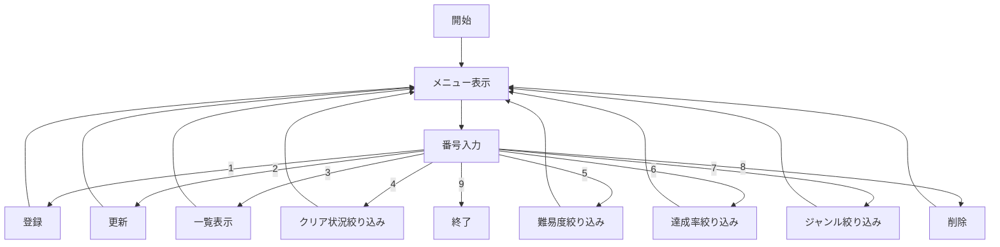

# TaikoNote

太鼓の達人のプレイ記録（リザルト）を登録・管理できるJava製CLIアプリケーション

## 目次

- [コンセプト](#コンセプト)
- [対象ユーザー（ペルソナ）](#対象ユーザーペルソナ)
- [ユーザーストーリー](#ユーザーストーリー)
- [主な機能](#主な機能)
- [データ設計](#データ設計)
- [クラス設計](#クラス設計)
- [処理の流れ](#処理の流れ)
- [フォルダ構成](#フォルダ構成)
- [動作環境・実行方法](#動作環境実行方法)
- [今後の拡張予定](#今後の拡張予定)

## コンセプト

太鼓の達人のプレイ結果を1曲ごとに記録し、クリア状況や達成率で振り返られる自分専用のプレイ日記アプリ

## 対象ユーザー（ペルソナ）

| 項目 | 内容 |
| --- | --- |
| 名前 | 山田 花子 |
| 年齢 | 22歳 |
| 職業 | 会社員 |
| 趣味 | 太鼓の達人（ゲームセンター通い） |
| 困っていること | どの曲をどこまでクリアしたか記憶だけでは追いきれない |
| 利用目的 | プレイ結果を記録して自分の成長を振り返りたい |

## ユーザーストーリー

- 太鼓プレイヤーとしてプレイ結果を記録したい なぜなら自分の成長を振り返りたいから
- 太鼓プレイヤーとして未クリアの曲だけ一覧で見たい なぜなら次に練習すべき曲を選びたいから
- 太鼓プレイヤーとして達成率で絞り込みたい なぜなら記録更新が狙える曲を見つけたいから

## 主な機能

| No | 機能 | 概要 |
| --- | --- | --- |
| 1 | リザルトの登録 | 曲名・難易度・ジャンル・レベル・スコアなどを登録（同一曲＋同一難易度が既にあれば更新に誘導） |
| 2 | リザルト更新 | IDを指定して既存データを編集（項目ごとに空欄なら変更なし） |
| 3 | 一覧出力 | 登録済みの全リザルトを表示 |
| 4 | クリア状況絞り込み | 未クリア／クリア／フルコンボ／ドンだフルコンボで絞り込み |
| 5 | 難易度絞り込み | かんたん〜おに裏の5段階で絞り込み |
| 6 | 達成率絞り込み | 達成率(%)の下限・上限を指定して絞り込み |
| 7 | ジャンル絞り込み | ポップス・アニメなど7ジャンルで絞り込み |
| 8 | データ削除 | IDを指定してリザルトを削除 |
| 9 | 終了 | アプリを終了 |

登録・更新・削除はCRUD（Create／Read／Update／Delete）に対応しています。すべての数値入力・選択肢入力は不正な形式や範囲外の値が入力されると再入力を促す仕様です。

## データ設計

1曲分のリザルトは以下の項目を保持します（`Score`クラス／`scores.csv`）。

| 項目 | 型 | 内容 |
| --- | --- | --- |
| id | int | 管理番号（自動採番） |
| songName | String | 曲名 |
| genre | int | ジャンル（1:ポップス 2:アニメ 3:キッズ 4:ゲーム/バラエティ 5:ナムコオリジナル 6:クラシック 7:ボーカロイド） |
| difficulty | int | 難易度（1:かんたん 2:ふつう 3:むずかしい 4:おに 5:おに裏） |
| level | String | レベル（星の数 1〜10） |
| score | int | スコア |
| yoi | int | 良の数 |
| ka | int | 可の数 |
| fuka | int | 不可の数 |
| cleared | boolean | クリアしたか（y/n） |

クリア状況（未クリア／クリア／フルコンボ／ドンだフルコンボ）と達成率は保存せず、良・可・不可・クリアフラグから都度計算します。

達成率の計算式

```
達成率(%) = ((良 × 1.0 + 可 × 0.5) / (良 + 可 + 不可)) × 100
```

CSVは以下の形式で保存されます（`src/TaikoNote/scores.csv`）。

```
ID,曲名,ジャンル,難易度,レベル,スコア,良,可,不可,クリア状況
1,スーハー2000,5,4,10,823300,445,202,21,y
```

## クラス設計

| クラス | 役割 |
| --- | --- |
| `Main` | プログラムの開始と全体制御 メニュー選択に応じた各処理の呼び出し |
| `Menu` | メニューや選択肢の表示 |
| `ScoreService` | リザルトの登録・一覧・更新・削除・絞り込み（CSVの読み書き） |
| `Score` | 1曲分のリザルトを保持するModel クラス／CSV変換 |
| `InputUtil` | 入力受付と入力チェック（数値・範囲・y/n・空欄許容の各種安全入力） |

## 処理の流れ



## フォルダ構成

```
src/
└── TaikoNote/
    ├── Main.java
    ├── Menu.java
    ├── Score.java
    ├── ScoreService.java
    ├── InputUtil.java
    └── scores.csv
```

## 動作環境・実行方法

- Java 8以上

```
# コンパイル（srcディレクトリで実行）
javac TaikoNote/*.java -d out

# 実行
java -cp out TaikoNote.Main
```

## 今後の拡張予定

- 曲名・スコアでの並び替え
- 曲名のあいまい検索
- 一覧表示時に達成率(%)を表示
- CSVの簡易エスケープ対応（曲名にカンマを含む場合）
