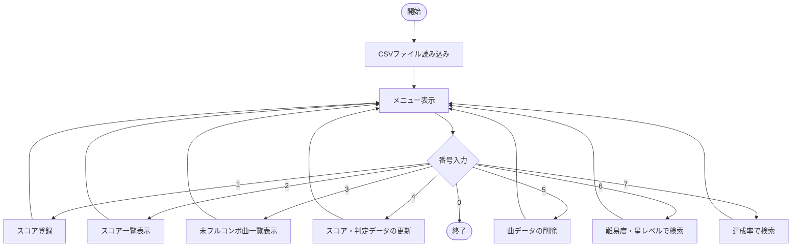
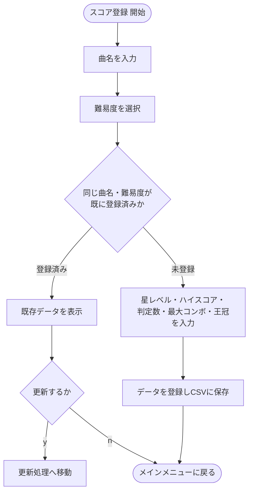

# Taiko Note

太鼓の達人のプレイ結果（ハイスコア・判定数・王冠）を記録・分析するCLIアプリです。
入出力はすべてターミナルで行い、データは `src/TaikoNote/scores.csv` に保存されます。

## フォルダ構成

```
TaikoNote/
├── .project
├── .classpath
└── src/
    └── TaikoNote/             ← パッケージ名 = フォルダ名
        ├── Main.java          全体制御（メニュー表示・処理分岐）
        ├── Score.java         スコアデータのModelクラス
        ├── Difficulty.java    難易度分類のenum
        ├── Crown.java         クリア状況（王冠）のenum
        ├── ScoreService.java  CRUD・検索・CSV永続化
        ├── InputUtil.java     ターミナル入力の受付・バリデーション
        ├── CsvUtil.java       CSVエスケープ／パース処理
        ├── MenuConst.java     メニュー文言・定数
        └── scores.csv         データファイル（CSV）
```

全クラスが単一パッケージ `TaikoNote` に属するため、クラス間の `import` は不要です。

## Eclipseへの取り込み方

1. Eclipseで `File > Import > General > Existing Projects into Workspace` を選択
2. `TaikoNote` フォルダを選択してインポート
3. `src/TaikoNote/Main.java` を右クリック → `Run As > Java Application`

コマンドラインで実行する場合（JDKが必要です）:

```bash
cd TaikoNote
javac -d bin -encoding UTF-8 src/TaikoNote/*.java
java -cp bin TaikoNote.Main
```

※ 実行はプロジェクトルート（`src` フォルダと同じ階層）で行ってください。
　 `src/TaikoNote/scores.csv` が無い場合は初回起動時に自動生成されます。
　 Eclipseで `Run As > Java Application` を使う場合、デフォルトの作業ディレクトリは
　 プロジェクトルートになるため、そのまま実行して問題ありません。

## データ設計

| 項目名 | 型 | 内容 |
| --- | --- | --- |
| `id` | `int` | 管理用ID（自動採番） |
| `title` | `String` | 曲名 |
| `difficulty` | `enum Difficulty` | 難易度分類（かんたん/ふつう/むずかしい/おに/裏おに） |
| `starLevel` | `int` | 星レベル（1〜10） |
| `score` | `int` | ハイスコア |
| `good` | `int` | 判定「良」の数 |
| `ok` | `int` | 判定「可」の数 |
| `bad` | `int` | 判定「不可」の数 |
| `maxCombo` | `int` | 最大コンボ数（達成率の算出に使用） |
| `crown` | `enum Crown` | クリア状況（なし/クリア/フルコンボ/ドンダフルコンボ） |

難易度分類（`difficulty`）と星レベル（`starLevel`）を分離しているため、
「おに★10」のような検索も、難易度分類とレベルを組み合わせて絞り込めます。

## 達成率の計算式

```
達成率(%) = ((良の数 × 1 + 可の数 × 0.5) ÷ (良の数+可の数+不可の数)) × 100
```

メニュー「7. 達成率で検索」から、下限〜上限の範囲を指定して検索できます
（例: 90〜100% で「もう少しでフルコンボ」の曲を抽出、など）。

## メニュー一覧

1. スコア登録（Create）
2. スコア一覧表示（Read）
3. 未フルコンボ曲一覧表示（Read）
4. スコア・判定データの更新（Update）
5. 曲データの削除（Delete）
6. 難易度・星レベルで検索
7. 達成率で検索
0. 終了

## 処理フロー



スコア登録時に曲名・難易度が重複している場合の詳細フローは以下の通りです。



## 補足・制約事項

* JDK未インストール環境で作成したため、本ファイル一式は **javacによる実機コンパイル確認は行えていません**。
  括弧・波括弧の対応や、パッケージ統合に伴うimport整理・メソッドシグネチャの整合性は
  目視で入念に確認済みですが、Eclipseへのインポート後、最初のビルドでエラーが出ないか
  一度ご確認ください。
* 曲名にカンマやダブルクォートが含まれてもCSVが壊れないよう、簡易的なクォート処理を実装しています。
